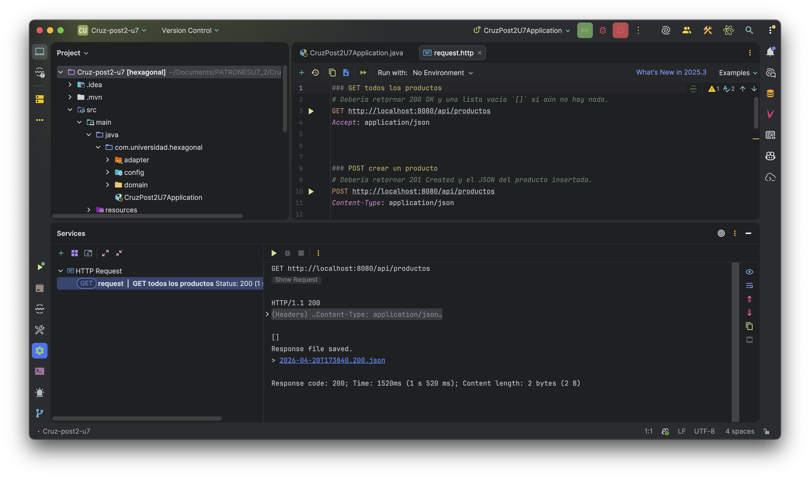
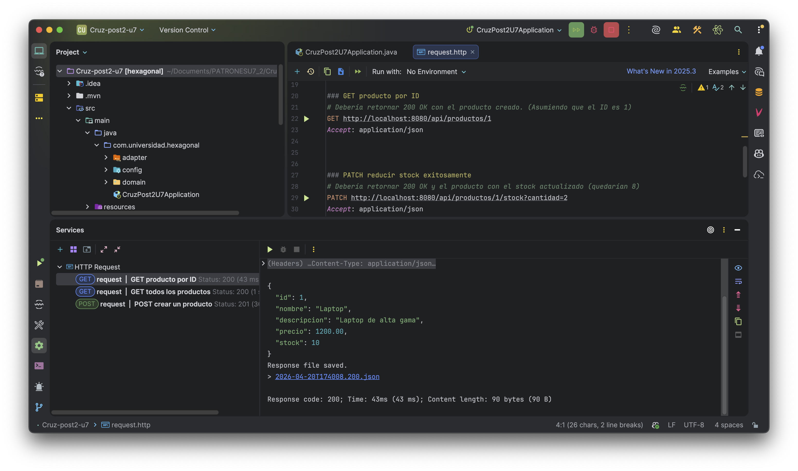
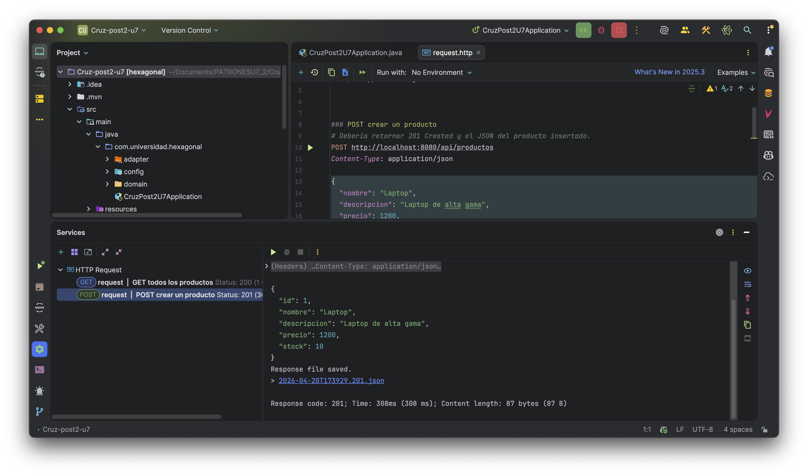
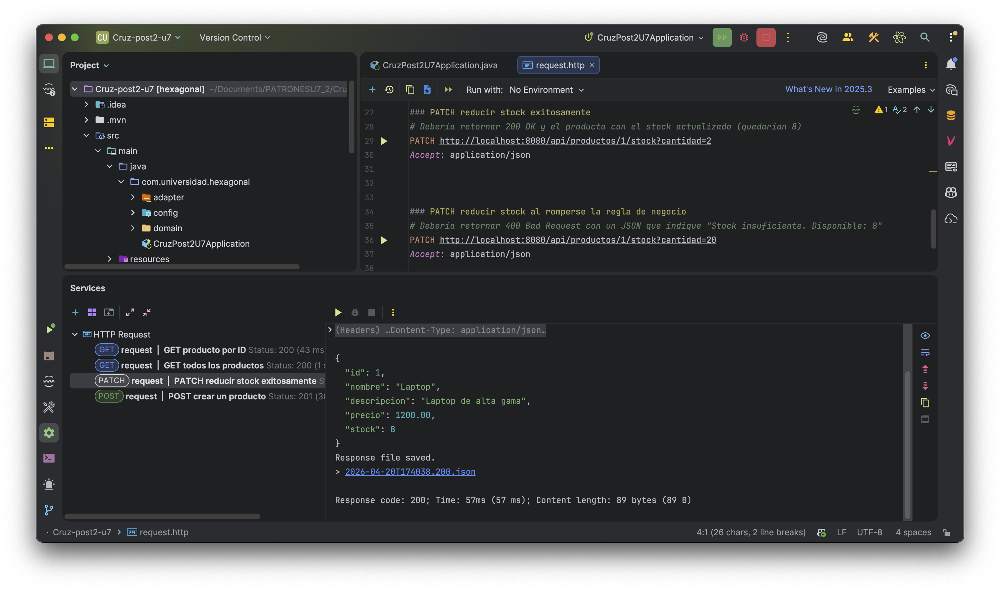
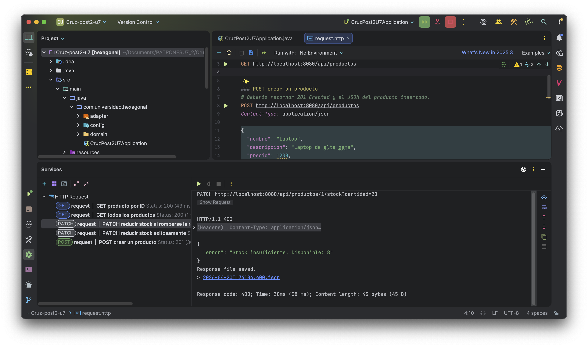

# Cruz_post2_u7

Este proyecto es una API REST para la gestión de **Productos**, desarrollada en Java utilizando **Spring Boot** y siguiendo fielmente los principios de la **Arquitectura Hexagonal** (Ports & Adapters).

---

## 🏗️ Arquitectura y Diagrama de Capas

El proyecto está diseñado bajo una separación estricta de responsabilidades, asegurando que el **Dominio** (lógica de negocio) sea agnóstico a los frameworks o tecnologías de infraestructura como la base de datos o la capa web de Spring.

```text
+-----------------------------------------------------------+
|                      Frameworks                           |
|      +------------------------------------------+         |
|      |               Adapters                   |         |
|      |    +------------------------------+      |         |
|      |    |          Dominio             |      |         |
| WEB  | ➡ | Ports (In)                 |      |         |
| API  | ➡ |      [Modelos de Negocio]    |      |         |
|      |    | Ports (Out)      ⬇         |      |         |
|      |    +------------------|-----------+      |         |
|      |                       |    |             |         |
|      |  REST Controllers  <--+    +--> JPA / DB |         |
|      +------------------------------------------+         |
|                       Spring Boot                         |
+-----------------------------------------------------------+
```

### 🧩 Desglose Estructural

* **Dominio (`/domain`)**: El núcleo del sistema.
    * **Modelos**: Entidad puramente conceptual `Producto.java`.
    * **Puertos de Entrada (In)**: Casos de uso como `ListarProductosUseCase`.
    * **Puertos de Salida (Out)**: Interfaces para persistencia `ProductoRepositoryPort`.
    * **Servicios**: Implementación de la lógica de negocio pura en `ProductoDomainService`. *No contiene dependencias hacia Spring ni JPA*.
* **Adaptadores (`/adapter`)**: Las vías de integración al mundo exterior.
    * **Entrada (`/in/web`)**: Controladores REST y manejadores de excepciones (`ProductoController`, `GlobalExceptionHandler`).
    * **Salida (`/out/persistence`)**: Mapeadores y repositorios hacia la base de datos H2 (`ProductoJpaEntity`, `ProductoRepositoryAdapter`).

---

## ⚙️ Instrucciones de Ejecución

Para levantar o compilar este proyecto requieres tener **Java 17** y Maven instalados.

### Compilar y Empaquetar
Para verificar que el código compila y los test corren adecuadamente sin errores:
```bash
./mvnw clean package
```

### Ejecutar Localmente
Inicia la API levantando el servicio de Spring Boot y su base de datos local en memoria (H2):
```bash
./mvnw spring-boot:run
```

La aplicación se ejecutará en: `http://localhost:8080`

---

## ✅ API Testing (Request Examples)

Un archivo `request.http` está disponible en la raíz del proyecto para evaluar fácilmente los Endpoints directamente desde el IDE.

### 1. `GET` Lista Vacía
Retorna un HTTP 200 con un Array vacío inicialmente:
```http
GET http://localhost:8080/api/productos
Accept: application/json
```

### 2. `POST` Creación exitosa
Deberá retornar HTTP 201 Created:
```http
POST http://localhost:8080/api/productos
Content-Type: application/json

{
  "nombre": "Laptop",
  "descripcion": "Laptop de alta gama",
  "precio": 1200,
  "stock": 10
}
```

### 3. `PATCH` Update exitoso
Retorna HTTP 200 y merma en 2 unidades el stock.
```http
PATCH http://localhost:8080/api/productos/1/stock?cantidad=2
```

### 4. `PATCH` Reglas de Negocio / Stock Excedido
Retorna un HTTP 400 Bad Request si la cantidad solicitada mermando supera la disponibilidad.
```http
PATCH http://localhost:8080/api/productos/1/stock?cantidad=20
```

---

## 📷 Capturas de Pantalla (Pruebas)

### 1. GET Todos los Productos (200 OK)


### 2. GET Producto por ID (200 OK)


### 3. POST Crear Producto (201 Created)


### 4. PATCH Reducir Stock Exitosamente (200 OK)


### 5. PATCH Error de Regla de Negocio (400 Bad Request)


